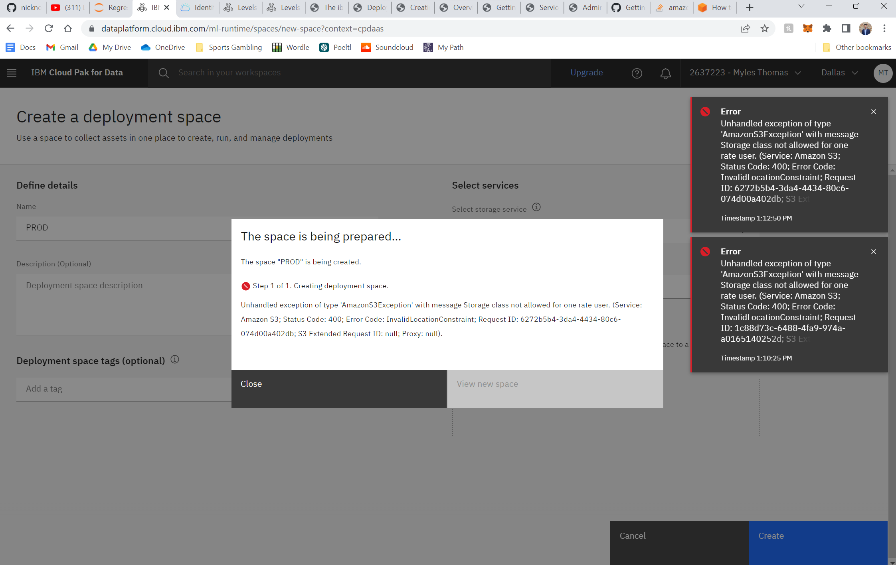

# Nicholas Renotte 

Steps starting out:
1. Create folder on local user 'nicholas_renotte' ie. C:\Users\Myles\nicholas_renotte
2. Create an instructions.md file (just like this one, to take notes with)
3. Download Python: https://www.python.org/downloads/
4. Download JupyterLab with pip: pip install jupyterlab
5. Load JupyterLab: jupyter-lab
- If you are new to this one, then make sure to do the following settings:
    - Auto close brackets: Settings -> Auto Close Brackets

## Building Full-Stack Machine Learning Apps with Watson Machine Learning

[Youtube Playlist](https://www.youtube.com/watch?v=rr-KwIjinpM&list=PLgNJO2hghbmjNrHZqplNMEpsW-QLFdvJV&index=1)

[Github Repo](https://github.com/nicknochnack/DeployingMachineLearningModels)

An end to end walkthrough for building and deploying machine learning models with Python and Watson Machine Learning.

### Exploratory Data Analysis With Pandas || Python Machine Learning PT.1

First part of any data project!

Video Overview
1. Loading data with pandas
2. Exploratory data analysis
3. Data Viz with seaborn and matplotlib


Scenario
- Business approached with some data
- Forecast transactions
- Multiple revenue streams
- Want an app to predict stuff

Goal: Build app so that if user enters in fields, they get a prediction back
- ie. the entire data science life cycle!

Steps in data lifecycle:
1. Berry = Business Understanding
2. Drove - Data Understanding
3. Directly to the - Data Prep
4. Medical - Modeling
5. Emergency - Evaluation
6. Department - Deployment!

To do:
- mkdir full_stack_ml_app_watson / cd full_stack_ml_app_watson
- Download .ipynb from this link in the Github Repo: [Regression Model-V4-Template.ipynb](https://github.com/nicknochnack/DeployingMachineLearningModels/blob/main/Regression%20Model-V4-Template.ipynb)
    - Save it here: "C:\Users\Myles\full_stack_ml_app_watson\nicholas_renotte\Regression Model-V4-Template.ipynb"

- Donwload the dataset: [regression.csv
](https://github.com/nicknochnack/DeployingMachineLearningModels/blob/main/regression.csv)

- Open the file in jupyterlab: cd .. > jupyter-lab 
    - This moves me back to where my directory is ie. C:/Users/Myles

- Run all cells
    - You may get some errors, once you fix them you'll be down to 

Note: Most of this code is really basic DS stuff, so I don't have much to takes notes on...

### Preparing Pandas Dataframes for Machine Learning || Python Machine Learning PT.2

What is covered:
1. Removing columns with pandas
2. Fixing data types using .astype()
3. One-hot encoding data using get_dummies()

My notes:
- Data prep
- Categorical variables w/ 1 hot encoding
- Dtypes

### Python Machine Learning with Scikit Learn - Regression || Python Machine Learning PT.3

What is covered:
1. Training models with sci-kit learn
2. Hyperparameter tuning with GridSearchCV
3. Evaluating ML Models

My notes:
- 5 pipelines, 1 for each algorithm:
    - Random Forest
    - Gradient Boosting
    - Ridge Regression
    - LASSO Regression
    - Elastic Net Regression

- Hyperparameters:
    - Use a dict/grid that has the hyperparameters prepared for each 5 different models

- GridSearchCV: Automatically forms our hyperparameter tree for us
    - Loop through the 5 pipelines and pass the pipeline/algo with its hyperparams
        - n_jobs=-1: Use all of the machines available that we have!
        - NotFittedError: Makes sure that the model successfully converges

- Making Predictions
    - Straight forward, use fit_models for all 5 to look for the best performing algo
        - R2: Variance in the features
            - the proportion of the variance in the dependent variable that is predictable from the independent variable(s).
        - MAE: Measures absolute error 
            - measured as the average of the absolute error values


### Deploying Machine Learning Models Online with Watson Machine Learning | Python Scikit-Learn

What is covered:
1. Saving models to Watson Machine Learning
2. Creating online deployments with Python
3. Scoring your model using the Python API

How it works:
1. Train model inside of Juptyer Notebook, using scikit-learn
2. Save and deploy model to Watson Machine Learning using Python
3. Grab UID and send scoring requests to your deployed endpoint
- UID = Unique ID/Identifier

Note: Get best_model before starting

#### Deployment

##### Import and install dependencies

Download IBM Watson - ML: !pip install ibm-watson-machine-learning

Imports dependencies:

``` python
from ibm_watson_machine_learning import APIClient
import json
import numpy as np
```

##### Authenticate and Set Space

Log onto IBM Cloud: 
- Setup an account

Create Resource > AI/Machine Learning > Watson Machine Learning
- Location he used: Dallas (us-south)
- Pricing Plan: Lite 
- Service name: Kept the same ie. Watson Machine Learning-c5
- Resource group: Default
- Tags: na
- Access management tags: na

Click create!

Note: Free is more than enough to get started

Access in Watson Studio / IBM Cloud Pak for Data

##### Setup Deployment Space

Allows you to deploy models into different environments
- Test/Train/Validate

Steps:

- 

old^^^

##### 1. Saving models to Watson Machine Learning

##### 2. Creating online deployments with Python

##### 3. Scoring your model using the Python API
 ^^^old

##### 6.1 Import and Install dependencies

!pip install -U ibm-watson-machine-learning

``` python
from ibm_watson_machine_learning import APIClient # client to work with ML service
import json
import numpy as np
```

##### 6.1.5 Prepare IBM Cloud

Start on IBM Cloud and set up a Deployment API
- https://www.ibm.com/cloud/free
- Get started for free > Login > Sign in with IMBid > mylescgthomas@gmail.com

- From Dashboard (https://www.ibm.com/cloud), Create Resourcee > Catalog > AI/Machine Learning > Watson Machine Learning ie. https://cloud.ibm.com/catalog/services/watson-machine-learning
    - Location he used: Dallas (us-south)
    - Pricing Plan: Lite 
    - Service name: Watson Machine Learning-myles
    - Resource group: Default
    - Tags: na
    - Access management tags: na

- Oepn up your IBM Watson Studio
- New Project
    - Deployment > New Deployment Space > Create New Watson Studio > New project
    - Name: regression_endpoint_nr
    - Description: Train a model and deploy to the Cloud
    - Restrict who can be a collaborator
    - Select storage service: Add > One Rate > Create > Refresh > Create
        - The name ended up being 'Cloud Object Storage-ak'
    
    - After pressing Create, You will be on an 'Overview' screen
        - Our Project is already setup, go back to 'IBM Watson Studio' to set up a Deployment.
            - https://dataplatform.cloud.ibm.com/home2?context=cpdaas

- New Deployment Space
    - Name: PROD

    - Storage Servive: Create new one > Create 
        - Note: You may need to make yourself 
        -  Cloud Pak for Data as a Service [main menu](https://dataplatform.cloud.ibm.com/home2?context=cpdaas) > Administration > Access (IAM) > Users > Myles Thomas > Access > 
            - Documentation/Article on this: https://dataplatform.cloud.ibm.com/docs/content/wsj/analyze-data/ml-service-instance.html#checking-roles
        - 

    - Select machine learning servive: Watson Machine Learning-8c (We just created this above)
    - Press Create

Deployment space is ready. Back to Jupyter Notebooks!
- Keep this open, because once we actually save our model we will be able to see it in the web browser

##### 6.2 Authenticate and Set Space

Set up Credentials Dict with the following:
- URL: Use the dallas url ie. 
- API Key: IBM Cloud API Key ie. 
    - IBM Watson > Mange > Access (IAM) > API Keys > Create an IBM Cloud API Key
        - Name: AnythingWorks (he did ScikitLearnAPIKey)
        - Desription: None

            - Note: Make sure to copy the API Key to clipboard/notes, you only get to see it once!

We are now done in the IBM Cloud for now, and can work straight from Jupyter.

##### 6.3 Save and Deploy Model


##### Score Against Deployed Model


So... I am actually getting stuck above at the step 6.1 when trying to create a Devployment Space...



Erro message: Error Code: InvalidLocationConstraint; Request ID: 1c88d73c-6488-4fa9-974a-a0165140252d